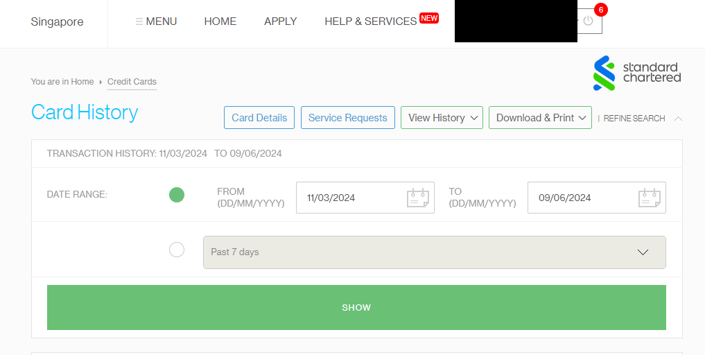
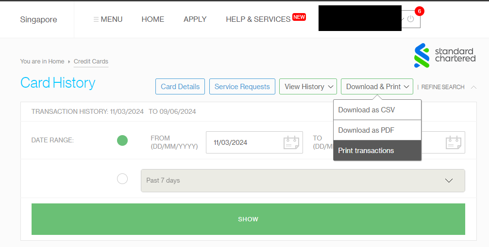
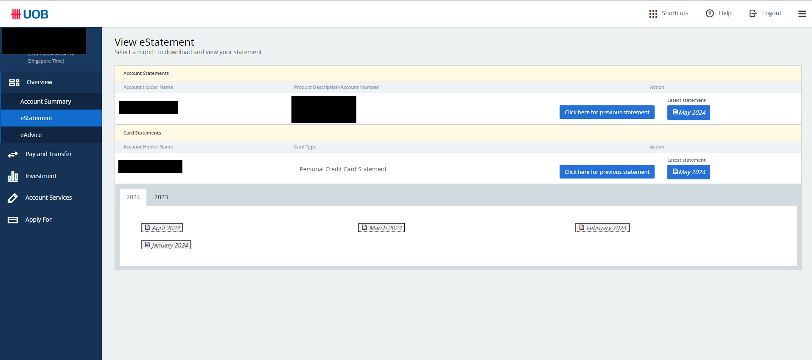

## Bank Statement Converter

The Bank Statement Converter is a versatile application designed to simplify the process of converting bank statements into a specific CSV format. It automates the extraction of transaction details from bank statements, streamlining data entry tasks and ensuring accuracy.

### Key Features:
- Automatic extraction of transaction details from various bank statement file types.
- Conversion of extracted data into a standardized CSV format.
- User-friendly interface for easy navigation and customization.
- Compatibility with different bank statement formats, ensuring broad usability.

Whether you're a small business owner, accountant, or individual managing finances, the Bank Statement Converter saves time and effort, enabling you to focus on more critical tasks with confidence in your financial data accuracy.

## How to Run the Program

Follow these steps to set up and run the program:

1. **Ensure Python is Installed**
    - Make sure you have Python installed on your system. You can download it from the [official Python website](https://www.python.org/downloads/).
    - Verify the installation by running the following command in your terminal or command prompt:
        ```sh
        python --version
        ```

2. **Install Required Packages**
    - Install the necessary Python packages using `pip`. Run the following command in your terminal or command prompt:
        ```sh
        pip install -r requirements.txt
        ```

3. **Run the Program**
    - Execute the GUI script to start the program. Run the following command:
        ```sh
        python gui.py
        ```

4. **Program Interface**
    - After running the command, the program's graphical user interface (GUI) should appear on your screen.

5. **Select File Types**
    - Within the GUI, you will have options to select different file types for download. Choose the file types you need (e.g., CSV, PDF) and proceed with the desired actions.

### Example Commands

Here is an example of the commands you might run in your terminal:

```sh
# Check Python installation
python --version

# Install required packages
pip install -r requirements.txt

# Run the program
python gui.py
```
#### To update categories
- Refer to banks.py get_category function to modify the categories

### For each type of bank

#### Steps to Download SC CSV/PDF bank statement

Follow these steps to download credit card data as a CSV or PDF file:

1. **Click on Home**
    - Navigate to the homepage.

2. **Click on Credit Cards**
    - On the navigation bar, locate and click on the "Credit Cards" section.

3. **Click on Refine Search**
    - To filter the credit card results, click on the "Refine Search" option.

4. **Select via Date (if applicable)**
    - If you need to select data based on a date range, use the date filter options provided in the "Refine Search" section.

5. **Download as CSV/PDF**
    - After refining your search, choose the desired format (CSV or PDF) and click to download the file.






#### Steps to Download UOB PDF statements

Follow these steps to download credit card data as a CSV or PDF file:

1. **Click on Overview**
    - Navigate to the homepage and click on overview to toggle more options

2. **Click on estatements**
    - Click on estatements to get all the estatemeents
    

